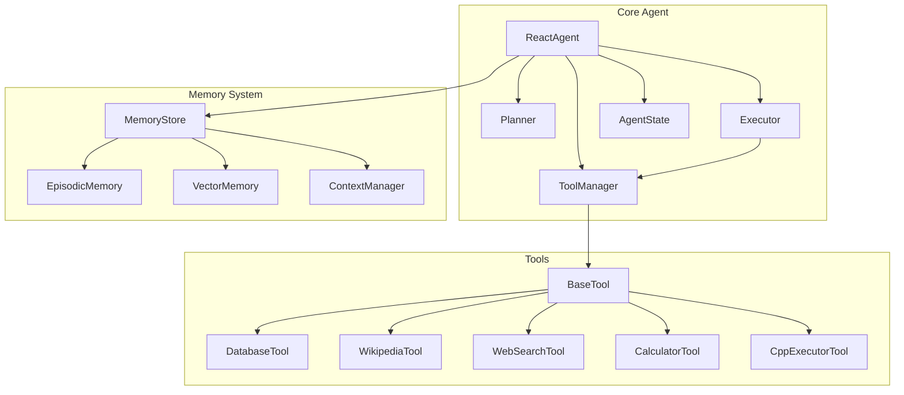
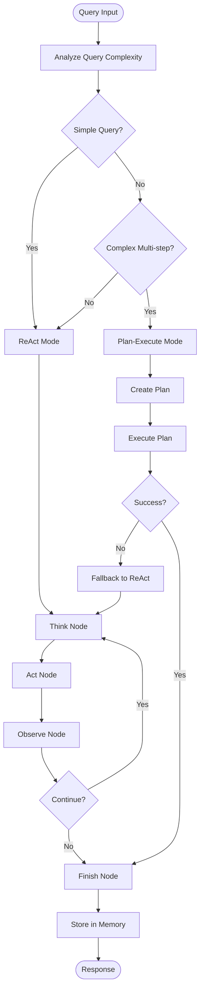
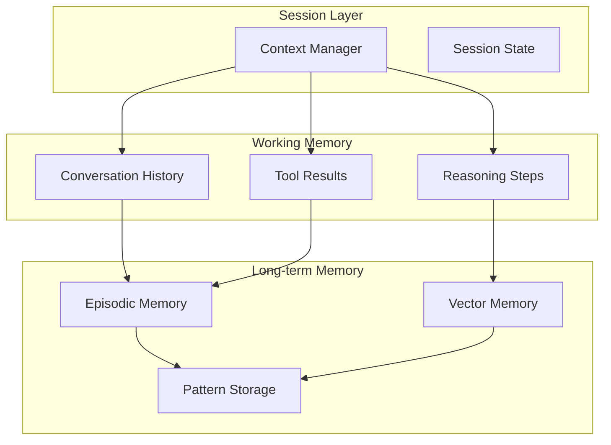
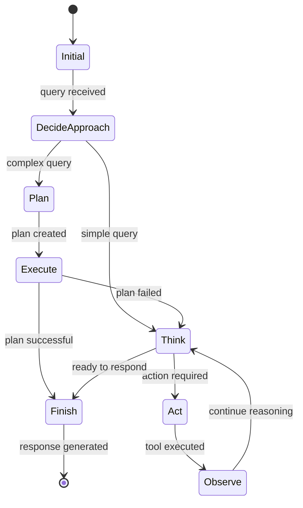

# Hybrid ReAct Agent Service - Architecture Document

## 🏗️ Overview

The Hybrid ReAct Agent Service is a sophisticated AI agent system that intelligently combines two powerful reasoning paradigms:

1. **ReAct (Reasoning and Acting)**: Step-by-step thought-action-observation cycles
2. **Plan-Execute**: Upfront planning with structured execution for complex tasks

The system automatically selects the most appropriate approach based on query complexity, supported by advanced memory management and context sharing capabilities.

## 🧠 Core Architecture Principles

### 1. Hybrid Intelligence
- **Adaptive Strategy Selection**: Automatically chooses between ReAct and Plan-Execute based on task analysis
- **Fallback Mechanisms**: Falls back to ReAct mode if Plan-Execute fails
- **Performance Optimization**: Minimizes computation while maximizing accuracy

### 2. Multi-layered Memory System
- **Episodic Memory**: Stores complete interaction episodes for learning
- **Vector Memory**: Semantic similarity search for contextual relevance
- **Context Manager**: Session-based state management
- **Memory Store**: Multi-type persistent storage

### 3. Extensible Tool Ecosystem
- **Modular Design**: Plugin-like architecture for easy tool addition
- **Standardized Interface**: All tools implement the same `BaseTool` interface
- **Context Sharing**: Tools can share data through the context manager

## 🔄 System Components

### Core Agent Components



### 1. ReactAgent (Main Orchestrator)
**Location**: `agent/react_agent.py`

**Responsibilities**:
- Mode selection and switching
- Session management
- Graph compilation and execution
- Response formatting and error handling

**Key Methods**:
```python
async def run(query: str) -> Dict[str, Any]
async def _decide_approach_node(state: AgentState) -> AgentState
async def _think_node(state: AgentState) -> AgentState
async def _act_node(state: AgentState) -> AgentState
async def _observe_node(state: AgentState) -> AgentState
```

### 2. Planner (Strategic Planning)
**Location**: `agent/planner.py`

**Responsibilities**:
- Query complexity analysis
- Multi-step plan generation
- Dependency resolution
- Strategy recommendation

**Key Classes**:
```python
class PlanType(Enum):
    SEQUENTIAL = "sequential"
    PARALLEL = "parallel"
    CONDITIONAL = "conditional"
    ITERATIVE = "iterative"

@dataclass
class PlanStep:
    id: str
    description: str
    tool: str
    input_template: str
    dependencies: List[str]
```

### 3. Executor (Plan Execution)
**Location**: `agent/executor.py`

**Responsibilities**:
- Plan step execution
- Dependency management
- Parallel execution coordination
- Error handling and recovery

### 4. Tool Manager (Tool Orchestration)
**Location**: `agent/tool_manager.py`

**Responsibilities**:
- Tool registration and discovery
- Tool execution with error handling
- Result formatting and validation

### 5. Memory System Components

#### Memory Store
**Location**: `memory/memory_store.py`

**Capabilities**:
```python
class MemoryType(Enum):
    CONVERSATION = "conversation"
    EPISODIC = "episodic"
    TOOL_RESULT = "tool_result"
    CONTEXT = "context"
    VECTOR = "vector"
```

#### Context Manager
**Location**: `memory/context_manager.py`

**Session Management**:
- Session lifecycle management
- Tool context sharing
- Reasoning step tracking
- Cross-session persistence

#### Episodic Memory
**Location**: `memory/episodic_memory.py`

**Episode Structure**:
```python
@dataclass
class Episode:
    id: str
    query: str
    response: str
    reasoning_steps: List[Dict]
    tools_used: List[str]
    success: bool
    duration: float
    timestamp: float
    importance: float
    metadata: Dict[str, Any]
```

## 🔄 Execution Flow

### Hybrid Mode Decision Tree



### Detailed Node Operations

#### 1. Decide Approach Node
```python
async def _decide_approach_node(self, state: AgentState) -> AgentState:
    """Analyzes query and decides between ReAct and Plan-Execute."""
    
    # Query complexity analysis
    complexity_indicators = [
        "then", "after", "first", "calculate", "search", "store",
        "multiple", "step", "process", "plan", "organize"
    ]
    
    # Decision logic based on:
    # - Query length and structure
    # - Keyword analysis
    # - Historical performance
    # - Available tools
```

#### 2. Plan Node
```python
async def _plan_node(self, state: AgentState) -> AgentState:
    """Creates a structured plan for complex queries."""
    
    # Plan generation process:
    # 1. Break down query into steps
    # 2. Identify required tools
    # 3. Determine dependencies
    # 4. Optimize execution order
    # 5. Estimate confidence levels
```

#### 3. Execute Node
```python
async def _execute_node(self, state: AgentState) -> AgentState:
    """Executes the generated plan."""
    
    # Execution strategy:
    # 1. Resolve dependencies
    # 2. Execute in optimal order
    # 3. Handle parallel execution
    # 4. Monitor success/failure
    # 5. Adapt on errors
```

## 🛠️ Tool Architecture

### Tool Interface

```python
class BaseTool(ABC):
    """Abstract base class for all tools."""
    
    def __init__(self, name: str, description: str):
        self.name = name
        self.description = description
    
    @abstractmethod
    async def execute(self, query: str, **kwargs) -> ToolResult:
        """Execute the tool with the given query."""
        pass
    
    @abstractmethod
    def get_schema(self) -> Dict[str, Any]:
        """Get the tool's input schema."""
        pass
```

### Built-in Tools

#### 1. Database Tool
**Purpose**: Persistent data storage and retrieval
**Operations**: CREATE, READ, UPDATE, DELETE, SEARCH
**Caching**: In-memory with TTL expiration

#### 2. Wikipedia Tool
**Purpose**: Knowledge retrieval and research
**Features**: 
- Article search and retrieval
- Content summarization
- Related topic suggestions

#### 3. Web Search Tool
**Purpose**: Real-time web search
**Integration**: Serper API
**Features**:
- Query optimization
- Result ranking
- Content extraction

#### 4. Calculator Tool
**Purpose**: Mathematical computations
**Capabilities**:
- Basic arithmetic
- Advanced functions
- Statistical operations
- Unit conversions

#### 5. C++ Executor Tool
**Purpose**: Code compilation and execution
**Features**:
- Secure sandboxed execution
- Error handling and reporting
- Output capture and formatting

## 🧠 Memory Architecture

### Memory Hierarchy



### Memory Operations

#### Storage Strategy
1. **Real-time Storage**: Critical information stored immediately
2. **Batch Processing**: Non-critical data processed in batches
3. **Compression**: Similar episodes compressed to save space
4. **Expiration**: Old data expired based on TTL and importance

#### Retrieval Strategy
1. **Context-based**: Retrieve based on current session context
2. **Similarity-based**: Vector similarity for related experiences
3. **Recency-based**: Recent interactions given higher priority
4. **Importance-based**: Critical episodes preserved longer

## 🔀 State Management

### Agent State Structure

```python
class AgentState(TypedDict):
    # Core state
    query: str
    output: Optional[str]
    current_step: int
    max_steps: int
    session_id: str
    mode: str
    
    # Execution tracking
    thoughts: List[str]
    actions: List[Dict[str, Any]]
    observations: List[str]
    tool_results: List[Dict[str, Any]]
    
    # Planning state
    plan: Optional[Plan]
    plan_status: str
    current_plan_step: int
    
    # Memory and context
    context: Dict[str, Any]
    metadata: Dict[str, Any]
    
    # Error handling
    has_error: bool
    error_message: Optional[str]
```

### State Transitions



## 🚀 Performance Optimizations

### 1. Caching Strategy
- **Tool Result Caching**: Cache expensive tool operations
- **LLM Response Caching**: Cache similar queries to reduce API calls
- **Memory Compression**: Compress similar episodes to save space

### 2. Parallel Execution
- **Plan Parallelization**: Execute independent plan steps in parallel
- **Tool Batching**: Batch similar tool operations
- **Async Operations**: All I/O operations are asynchronous

### 3. Memory Management
- **Session Cleanup**: Automatic cleanup of completed sessions
- **Memory Limits**: Configurable limits to prevent memory leaks
- **Garbage Collection**: Periodic cleanup of unused objects

### 4. LLM Optimization
- **Session Pooling**: Reuse LLM connections across sessions
- **Prompt Optimization**: Minimize token usage while maintaining quality
- **Model Selection**: Choose appropriate model based on task complexity

## 🔒 Security & Privacy

### 1. Data Protection
- **API Key Security**: Keys stored in environment variables only
- **Session Isolation**: Complete isolation between user sessions
- **Data Encryption**: Sensitive data encrypted at rest and in transit

### 2. Sandboxing
- **Tool Sandboxing**: All tools execute in controlled environments
- **Code Execution**: Secure sandboxing for code execution tools
- **Resource Limits**: Prevent resource exhaustion attacks

### 3. Access Control
- **Rate Limiting**: Prevent abuse through rate limiting
- **Input Validation**: Comprehensive input validation and sanitization
- **Audit Logging**: Complete audit trail of all operations

## 🔧 Configuration Management

### Environment-based Configuration
```python
class Config:
    # API Configuration
    GOOGLE_API_KEY = os.getenv("GOOGLE_API_KEY")
    SERPER_API_KEY = os.getenv("SERPER_API_KEY")
    
    # Model Configuration
    GEMINI_MODEL = "gemini-2.0-flash-lite"
    TEMPERATURE = 0.1
    MAX_TOKENS = 1000
    
    # Agent Configuration
    MAX_ITERATIONS = 10
    VERBOSE = True
    
    # Memory Configuration
    CACHE_TTL = 3600
    MAX_CACHE_SIZE = 1000
    
    # Performance Configuration
    SESSION_TIMEOUT = 1800
    MAX_CONCURRENT_SESSIONS = 100
```

### Runtime Configuration
- **Dynamic Mode Switching**: Change modes during execution
- **Tool Registration**: Register new tools at runtime
- **Memory Tuning**: Adjust memory parameters based on usage

## 🧪 Testing Architecture

### Test Categories

#### 1. Unit Tests
- **Tool Testing**: Individual tool functionality
- **Memory Testing**: Memory operations and persistence
- **State Management**: State transitions and consistency

#### 2. Integration Tests
- **End-to-End Flows**: Complete interaction flows
- **Memory Integration**: Cross-component memory sharing
- **Error Handling**: Error propagation and recovery

#### 3. Performance Tests
- **Load Testing**: Multiple concurrent sessions
- **Memory Usage**: Memory consumption patterns
- **Response Time**: Latency measurements

#### 4. Security Tests
- **Input Validation**: Malicious input handling
- **Session Isolation**: Cross-session data leakage
- **Resource Limits**: Resource exhaustion prevention

## 🔮 Future Architecture Enhancements

### 1. Multi-Modal Support
- **Vision Integration**: Image analysis and generation tools
- **Audio Processing**: Speech-to-text and text-to-speech
- **Document Processing**: PDF, Word, and other document formats

### 2. Distributed Architecture
- **Microservices**: Break components into microservices
- **Load Balancing**: Distribute load across multiple instances
- **Database Integration**: Replace in-memory storage with databases

### 3. Advanced AI Features
- **Model Fine-tuning**: Custom model training on user data
- **Reinforcement Learning**: Learn from user feedback
- **Multi-Agent Orchestration**: Coordinate multiple specialized agents

### 4. Enterprise Features
- **Authentication**: User authentication and authorization
- **Multi-tenancy**: Support for multiple organizations
- **Compliance**: GDPR, HIPAA, and other regulatory compliance

## 📊 Monitoring & Observability

### Metrics Collection
- **Performance Metrics**: Response times, success rates
- **Usage Metrics**: Tool usage, query patterns
- **Resource Metrics**: Memory usage, CPU utilization

### Logging Strategy
- **Structured Logging**: JSON-based structured logs
- **Correlation IDs**: Track requests across components
- **Debug Levels**: Configurable logging levels

### Health Checks
- **Component Health**: Individual component status
- **Dependency Checks**: External service availability
- **Performance Monitoring**: Real-time performance tracking

---

This architecture document provides a comprehensive overview of the Hybrid ReAct Agent Service design, implementation patterns, and future roadmap. The system is designed for scalability, maintainability, and extensibility while providing intelligent and efficient AI agent capabilities.