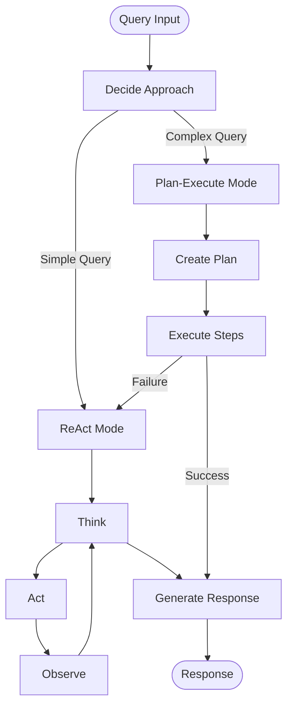

# Hybrid ReAct Agent Service

A sophisticated AI agent system that combines **ReAct (Reasoning and Acting)** and **Plan-Execute** paradigms with advanced memory management and context sharing. Built with LangGraph, LangChain, and Google Gemini for intelligent task execution and reasoning.

## 🚀 Key Features

### Core Capabilities
- **🧠 Hybrid Intelligence**: Automatically chooses between ReAct and Plan-Execute strategies based on task complexity
- **🔄 ReAct Pattern**: Implements Thought-Action-Observation cycles for step-by-step reasoning
- **📋 Plan-Execute Mode**: Creates and executes complex multi-step plans for sophisticated tasks
- **⚡ Real-time Thinking**: Watch the agent think and reason in real-time as it processes requests
- **🎯 Streaming Interface**: Live updates showing thought processes, tool execution, and decision making
- **🧠 Advanced Memory System**: Multi-layered memory with episodic, vector, and contextual storage
- **🔗 Context Sharing**: Persistent context across tool interactions and sessions
- **🛠️ Extensible Tool System**: Modular architecture supporting custom tool integration

### Intelligence Modes
1. **ReAct Mode**: Best for simple queries requiring immediate reasoning and action
2. **Plan-Execute Mode**: Optimal for complex multi-step tasks requiring upfront planning
3. **Hybrid Mode**: Intelligently selects the best approach based on query complexity

### Built-in Tools
- **📊 Database Tool**: Persistent data storage with caching (CRUD operations)
- **📚 Wikipedia Tool**: Research and information retrieval
- **🔍 Web Search Tool**: Real-time web search capabilities (Serper API)
- **🧮 Calculator Tool**: Mathematical computations and functions
- **⚡ C++ Executor Tool**: Code compilation and execution
- **🔧 Custom Tools**: Easy extension framework for domain-specific tools

### Memory & Context
- **Episodic Memory**: Stores complete interaction episodes for learning
- **Vector Memory**: Semantic similarity search for relevant past experiences
- **Context Manager**: Maintains session state and tool interaction history
- **Memory Store**: Multi-type storage (conversational, episodic, tool-specific)

## 📁 Project Architecture

```
react-agent-service/
├── agent/                    # Core agent implementation
│   ├── react_agent.py      # Main hybrid agent with mode switching
│   ├── planner.py           # Planning system for complex tasks
│   ├── executor.py          # Plan execution engine
│   ├── agent_state.py       # State management and data structures
│   ├── tool_manager.py      # Tool orchestration and management
│   └── planner_execution.mmd # Execution flow diagram
├── tools/                   # Tool implementations
│   ├── base_tool.py        # Abstract base class for all tools
│   ├── database_tool.py    # Persistent data operations
│   ├── wikipedia_tool.py   # Wikipedia search and retrieval
│   ├── web_search_tool.py  # Web search capabilities
│   ├── calculator_tool.py  # Mathematical computations
│   └── cpp_executor_tool.py # Code execution environment
├── memory/                  # Advanced memory system
│   ├── memory_store.py     # Core memory storage
│   ├── vector_memory.py    # Semantic search capabilities
│   ├── context_manager.py  # Session and context management
│   └── episodic_memory.py  # Episode storage and retrieval
├── examples/               # Usage examples and demos
│   ├── hybrid_agent_demo.py # Comprehensive demonstration
│   └── example_usage.py    # Basic usage examples
├── extensions/             # Future extensions and frameworks
│   └── multiagent_framework.py # Multi-agent system foundation
├── web_interface.py        # Streamlit web UI
├── chatbot.py             # Console interface
├── llm_manager.py         # LLM session management
├── config.py              # Configuration management
└── requirements.txt       # Dependencies
```

## 🔧 Installation & Setup

### Prerequisites
- Python 3.8+
- Google Gemini API key
- Optional: Serper API key for web search

### Quick Start

1. **Clone and Install**
```bash
git clone <repository-url>
cd react-agent-service
pip install -r requirements.txt
```

2. **Configure Environment**
```bash
cp .env.example .env
# Edit .env and add your API keys:
# GOOGLE_API_KEY=your_gemini_api_key
# SERPER_API_KEY=your_serper_api_key (optional)
```

3. **Run the Agent**
```bash
# Interactive launcher (recommended)
python3 launch_ui.py

# Real-time thinking web interface
streamlit run web_interface_streaming.py

# Standard web interface
streamlit run web_interface.py

# Console interface
python3 chatbot.py

# Streaming demo (console)
python3 demo_streaming.py

# Hybrid demo
python3 examples/hybrid_agent_demo.py
```

## 💡 Usage Examples

### Basic Programmatic Usage
```python
import asyncio
from agent.react_agent import ReactAgent

async def main():
    # Create hybrid agent (auto-selects best mode)
    agent = ReactAgent(verbose=True, mode="hybrid")
    
    # Simple query (will use ReAct)
    response = await agent.run("What is 2 + 2?")
    print(f"Result: {response['output']}")
    
    # Complex query (will use Plan-Execute)
    complex_query = """
    Calculate the square root of 144, then search for information 
    about that number in mathematics, and store both results 
    in the database
    """
    response = await agent.run(complex_query)
    print(f"Success: {response['success']}")
    print(f"Mode used: {response['metadata']['chosen_approach']}")

asyncio.run(main())
```

### Mode-Specific Usage
```python
# Force ReAct mode for step-by-step reasoning
react_agent = ReactAgent(mode="react")

# Force Plan-Execute mode for complex planning
planner_agent = ReactAgent(mode="plan_execute")

# Hybrid mode (recommended) - auto-selects best approach
hybrid_agent = ReactAgent(mode="hybrid")
```

### Advanced Memory Features
```python
# Access memory statistics
stats = await agent.get_memory_stats()
print(f"Episodes stored: {stats.get('episodes', 0)}")

# Memory persists across sessions for context sharing
response1 = await agent.run("Store my name as Alice")
response2 = await agent.run("What's my name?")  # Remembers Alice
```

### Real-time Streaming Usage
```python
import asyncio
from streaming_agent import StreamingChatbot, EventType

async def watch_agent_think():
    chatbot = StreamingChatbot(verbose=False, mode="hybrid")
    
    query = "Calculate 144 squared root and tell me about it"
    
    async for event in chatbot.chat_stream(query):
        if event.type == EventType.THINKING:
            print(f"🤔 Agent is thinking: {event.data['thought']}")
        
        elif event.type == EventType.ACTION_START:
            print(f"🔧 Executing: {event.data['action']}")
        
        elif event.type == EventType.COMPLETE:
            print(f"✅ Final answer: {event.data['response']['output']}")
            break

asyncio.run(watch_agent_think())
```

## 🏗️ Architecture Deep Dive

### Execution Flow (Hybrid Mode)


### Memory Architecture


### Tool Integration Pattern
```python
from tools.base_tool import BaseTool, ToolResult

class CustomTool(BaseTool):
    def __init__(self):
        super().__init__("custom_tool", "My custom tool description")
    
    async def execute(self, query: str, **kwargs) -> ToolResult:
        # Your tool logic here
        result = process_query(query)
        return ToolResult(success=True, data=result)
    
    def get_schema(self):
        return {
            "type": "object",
            "properties": {
                "query": {"type": "string", "description": "Input query"}
            }
        }
```

## 🎯 Use Cases

### Simple Queries (ReAct Mode)
- Mathematical calculations
- Information lookup
- Single-step operations
- Quick fact retrieval

### Complex Tasks (Plan-Execute Mode)
- Multi-step research projects
- Data processing pipelines
- Complex calculations with dependencies
- Workflow automation

### Hybrid Intelligence
- Travel planning with budget calculations
- Research with data storage
- Code generation and execution
- Multi-domain problem solving

## ⚙️ Configuration

Key settings in `config.py`:
```python
# Model settings
GEMINI_MODEL = "gemini-2.0-flash-lite"
TEMPERATURE = 0.1
MAX_TOKENS = 1000

# Agent behavior
MAX_ITERATIONS = 10
VERBOSE = True

# Memory settings
CACHE_TTL = 3600  # 1 hour
MAX_CACHE_SIZE = 1000
```

## 🧪 Testing & Examples

Run the comprehensive demo:
```bash
python examples/hybrid_agent_demo.py
```

Test specific components:
```bash
python test_agent.py
python test_memory_integration.py
```

## 🔍 Monitoring & Debugging

### Verbose Mode
Enable detailed logging:
```python
agent = ReactAgent(verbose=True)
```

### Memory Statistics
```python
stats = await agent.get_memory_stats()
print(json.dumps(stats, indent=2))
```

### Execution Metadata
```python
response = await agent.run("query")
print(f"Mode used: {response['metadata']['chosen_approach']}")
print(f"Steps taken: {len(response['steps'])}")
print(f"Execution time: {response['metadata']['execution_time']:.2f}s")
```

## 🚧 Extending the System

### Adding Custom Tools
1. Inherit from `BaseTool`
2. Implement `execute()` and `get_schema()` methods
3. Register in `ToolManager`

### Custom Memory Types
1. Extend `MemoryStore` with new memory types
2. Implement storage and retrieval logic
3. Integrate with `ContextManager`

### Multi-Agent Extensions
```python
from extensions.multiagent_framework import MultiAgentSystem

system = MultiAgentSystem()
system.add_agent("researcher", researcher_agent)
system.add_agent("analyzer", analyzer_agent)

result = await system.distribute_task({
    "type": "research_and_analyze",
    "query": "Latest AI developments"
})
```

## 📊 Performance Considerations

- **Memory Optimization**: Automatic cleanup of old sessions
- **Caching**: Built-in result caching for database operations
- **Parallel Execution**: Plan-Execute mode supports parallel step execution
- **Session Management**: Efficient LLM session handling

## 🔒 Security & Privacy

- API keys stored in environment variables
- No persistent storage of sensitive data
- Session isolation for multi-user environments
- Configurable cache TTL for data expiration

## 📚 References & Research

This implementation is based on:
- [ReAct: Synergizing Reasoning and Acting in Language Models](https://arxiv.org/abs/2210.03629)
- [Plan-and-Solve Prompting](https://arxiv.org/abs/2305.04091)
- [LangGraph Documentation](https://langchain-ai.github.io/langgraph/)

## 🤝 Contributing

1. Fork the repository
2. Create a feature branch (`git checkout -b feature/amazing-feature`)
3. Commit your changes (`git commit -m 'Add amazing feature'`)
4. Push to the branch (`git push origin feature/amazing-feature`)
5. Open a Pull Request

## 📝 License

MIT License - see LICENSE file for details.

## 🆘 Troubleshooting

### Common Issues

**ImportError with langchain packages**
```bash
pip install --upgrade langchain langgraph langchain-google-genai
```

**API Key Issues**
```bash
# Check environment variables
echo $GOOGLE_API_KEY
```

**Memory/Performance Issues**
```python
# Adjust configuration
Config.MAX_CACHE_SIZE = 500
Config.CACHE_TTL = 1800
```

### Debug Mode
```python
import logging
logging.basicConfig(level=logging.DEBUG)

agent = ReactAgent(verbose=True)
```

## 🎉 What's Next?

- [ ] Multi-modal tool support (image, audio)
- [ ] Distributed multi-agent systems
- [ ] Fine-tuning capabilities
- [ ] Integration with external APIs
- [ ] Performance optimization
- [ ] Advanced planning algorithms

---

Built with ❤️ using LangGraph, LangChain, and Google Gemini