# Hybrid ReAct Agent Service

A sophisticated AI agent system that combines **ReAct (Reasoning and Acting)** and **Plan-Execute** paradigms with advanced memory management and context sharing. Built with LangGraph, LangChain, and Google Gemini for intelligent task execution and reasoning.

## 🚀 Key Features

### Core Capabilities
- **🧠 Hybrid Intelligence**: Automatically chooses between ReAct and Plan-Execute strategies based on task complexity
- **🔄 ReAct Pattern**: Implements Thought-Action-Observation cycles for step-by-step reasoning
- **📋 Plan-Execute Mode**: Creates and executes complex multi-step plans for sophisticated tasks
- **⚡ Real-time Thinking**: Watch the agent think and reason in real-time as it processes requests
- **🎯 Streaming Interface**: Live updates showing thought processes, tool execution, and decision making
- **🧠 Unified Memory System**: Single interface for episodic, vector, contextual, and conversational memory
- **🔗 Context Sharing**: Persistent context across tool interactions and sessions
- **🛠️ Extensible Tool System**: Modular architecture supporting custom tool integration
- **🔍 Reflection Pattern**: Self-critique and iterative response refinement for higher quality outputs
- **🏢 Multi-Agent Framework**: Distributed agent coordination and collaboration capabilities
- **🔄 Adaptive Replanning**: Intelligent fallback mechanisms and strategy switching

### Intelligence Modes
1. **ReAct Mode**: Best for simple queries requiring immediate reasoning and action
2. **Plan-Execute Mode**: Optimal for complex multi-step tasks requiring upfront planning
3. **Hybrid Mode**: Intelligently selects the best approach based on query complexity

### Built-in Tools
- **📊 Database Tool**: Persistent data storage with caching (CRUD operations)
- **🗄️ MySQL Database Tool**: Direct connection to MySQL databases with schema discovery
- **📚 Wikipedia Tool**: Research and information retrieval
- **🔍 Web Search Tool**: Real-time web search capabilities (Serper API)
- **🧮 Calculator Tool**: Mathematical computations and functions
- **⚡ C++ Executor Tool**: Code compilation and execution
- **🗂️ File Manager Tool**: File system operations and management
- **💾 Unified Memory Tool**: Single interface for all memory operations
- **📝 Command Line Tool**: Execute system commands safely
- **🔧 Custom Tools**: Easy extension framework for domain-specific tools

### Memory & Context
- **Unified Memory System**: Single interface coordinating all memory types
- **Episodic Memory**: Stores complete interaction episodes for learning
- **Vector Memory**: Semantic similarity search for relevant past experiences
- **Context Manager**: Maintains session state and tool interaction history
- **Memory Store**: Multi-type storage (conversational, episodic, tool-specific)
- **Cross-Memory Search**: Search across all memory types with single queries

## 🧠 Adaptive Thinking Flow

The hybrid React Agent features sophisticated adaptive thinking that intelligently switches between different reasoning approaches based on real-time evaluation and learning from past experiences.

### Key Innovation: Dynamic Approach Switching
- **Intelligent Decision Making**: Uses query complexity analysis and episodic memory similarity to choose optimal approach
- **Real-time Evaluation**: Continuously assesses execution success and adapts strategy mid-flow
- **Adaptive Replanning**: Creates new plans when initial execution fails, with intelligent fallback mechanisms
- **Memory-Informed Learning**: Leverages past episodes to improve decision making over time

### Adaptive Flow Features
1. **Approach Selection**: Automatically determines whether to use Plan-Execute or ReAct based on:
   - Query complexity indicators (multiple steps, calculations, comparisons)
   - Similarity to successful past episodes
   - Tool usage patterns from historical data

2. **Execution Evaluation**: After plan execution, evaluates:
   - Success rate (≥70% threshold for completion)
   - Task completion status
   - Quality of results

3. **Adaptive Replanning**: When plans fail:
   - Generates new strategies with different approaches
   - Can switch from Plan-Execute to ReAct mid-execution
   - Prevents infinite loops with attempt limits
   - Graceful degradation to simpler approaches

4. **Seamless Integration**: ReAct and Plan-Execute modes work together:
   - ReAct serves as fallback for failed plans
   - Plan-Execute handles complex multi-step reasoning
   - Memory system learns from both approaches

### Visual Flow & Documentation
- **[Adaptive React Agent Thinking Flow](./adaptive_react_agent_flowchart.md)**: Detailed Mermaid diagram showing the complete decision and execution flow
- **[Adaptive Replanning Analysis](./ADAPTIVE_REPLANNING_ANALYSIS.md)**: In-depth analysis of the replanning mechanisms and strategies

### Benefits
- **Robustness**: Multiple fallback mechanisms prevent complete failures
- **Efficiency**: Uses the most appropriate approach for each query type
- **Learning**: Improves over time based on execution history
- **Flexibility**: Can handle both simple and complex queries effectively

## 🔍 Reflection Pattern

The agent incorporates a sophisticated reflection mechanism that enables self-critique and iterative improvement of responses.

### Reflection Capabilities
- **Quality Assessment**: Evaluates responses across 6 dimensions (accuracy, completeness, clarity, relevance, reasoning, evidence)
- **Self-Critique**: Identifies specific areas for improvement in generated responses
- **Iterative Refinement**: Automatically improves responses based on quality scores
- **Configurable Thresholds**: Set minimum quality requirements (0.0-1.0 scale)
- **Comprehensive Tracking**: Maintains history of all refinement cycles

### Quality Dimensions
1. **Accuracy**: Factual correctness and precision
2. **Completeness**: Full coverage of the original question
3. **Clarity**: Clear structure and presentation
4. **Relevance**: Direct relevance to the user's query
5. **Reasoning**: Sound logical reasoning and inference
6. **Evidence**: Appropriate supporting evidence and examples

### How It Works
```
Original Response → Self-Critique → Quality Assessment → Refinement (if needed) → Final Response
                                        ↓ (Quality < Threshold)
                                   Iterative Improvement Loop (Max 3 cycles)
```

## 📁 Project Architecture

```
react-agent-service/
├── agent/                         # Core agent implementation
│   ├── react_agent.py            # Main hybrid agent with mode switching
│   ├── planner.py                 # Planning system for complex tasks
│   ├── executor.py                # Plan execution engine
│   ├── agent_state.py             # State management and data structures
│   ├── tool_manager.py            # Tool orchestration and management
│   ├── reflection_module.py       # Self-critique and response refinement
│   ├── adaptive_replanner.py      # Intelligent fallback and replanning
│   └── planner_execution.mmd      # Execution flow diagram
├── tools/                         # Tool implementations
│   ├── base_tool.py              # Abstract base class for all tools
│   ├── database_tool.py          # Persistent data operations
│   ├── mysql_database_tool.py    # MySQL database integration
│   ├── wikipedia_tool.py         # Wikipedia search and retrieval
│   ├── web_search_tool.py        # Web search capabilities
│   ├── calculator_tool.py        # Mathematical computations
│   ├── cpp_executor_tool.py      # Code execution environment
│   ├── file_manager_tool.py      # File system operations
│   ├── command_line_tool.py      # System command execution
│   ├── unified_memory_tool.py    # Single interface for all memory
│   ├── conversation_history_tool.py # Legacy conversation access
│   └── enhanced_tool_manager.py  # Advanced tool orchestration
├── memory/                        # Advanced memory system
│   ├── memory_store.py           # Core memory storage
│   ├── vector_memory.py          # Semantic search capabilities
│   ├── context_manager.py        # Session and context management
│   ├── episodic_memory.py        # Episode storage and retrieval
│   └── unified_memory_manager.py # Unified memory coordination
├── extensions/                    # Multi-agent and extensions
│   ├── multiagent_framework.py   # Multi-agent system foundation
│   └── enhanced_multiagent.py    # Advanced multi-agent coordination
├── examples/                      # Usage examples and demos
│   ├── hybrid_agent_demo.py      # Comprehensive demonstration
│   ├── example_usage.py          # Basic usage examples
│   ├── mysql_database_example.py # MySQL integration demo
│   ├── adaptive_replanning_demo.py # Replanning showcase
│   └── multiagent_integration_demo.py # Multi-agent examples
├── docs/                          # Documentation
│   └── reflection_pattern.md     # Reflection pattern documentation
├── web_interface.py              # Standard Streamlit web UI
├── web_interface_streaming.py    # Real-time streaming interface
├── streaming_agent.py            # Streaming response agent
├── chatbot.py                    # Console interface
├── llm_manager.py               # LLM session management
├── config.py                    # Configuration management
├── mysql_config.py              # MySQL configuration
├── ARCHITECTURE.md              # Detailed architecture documentation
├── MULTIAGENT_ARCHITECTURE.md  # Multi-agent system design
├── UNIFIED_MEMORY_ARCHITECTURE_SUMMARY.md # Memory system docs
├── REFLECTION_IMPLEMENTATION_SUMMARY.md   # Reflection pattern docs
└── requirements.txt             # Dependencies
```

## 🔧 Installation & Setup

### Prerequisites
- Python 3.8+
- Google Gemini API key
- Optional: Serper API key for web search
- Optional: MySQL database for persistent storage

### Quick Start

1. **Clone and Install**
```bash
git clone <repository-url>
cd react-agent-service
pip install -r requirements.txt
```

2. **Configure Environment**
```bash
cp .env.example .env
# Edit .env and add your API keys:
# GOOGLE_API_KEY=your_gemini_api_key
# SERPER_API_KEY=your_serper_api_key (optional)

# Optional MySQL configuration:
# MYSQL_HOST=localhost
# MYSQL_PORT=3306
# MYSQL_USER=your_username
# MYSQL_PASSWORD=your_password
# MYSQL_DATABASE=your_database
```

3. **Run the Agent**
```bash
# Interactive launcher (recommended)
python3 launch_ui.py

# Real-time thinking web interface
streamlit run web_interface_streaming.py

# Standard web interface
streamlit run web_interface.py

# Console interface
python3 chatbot.py

# Streaming demo (console)
python3 demo_streaming.py

# Hybrid demo
python3 examples/hybrid_agent_demo.py
```

## 💡 Usage Examples

### Basic Programmatic Usage
```python
import asyncio
from agent.react_agent import ReactAgent

async def main():
    # Create hybrid agent with reflection (auto-selects best mode)
    agent = ReactAgent(
        verbose=True, 
        mode="hybrid",
        enable_reflection=True,  # Enable self-critique and refinement
        reflection_quality_threshold=0.7  # Minimum quality score
    )
    
    # Simple query (will use ReAct)
    response = await agent.run("What is 2 + 2?")
    print(f"Result: {response['output']}")
    print(f"Quality Score: {response['metadata'].get('final_quality_score', 'N/A')}")
    
    # Complex query (will use Plan-Execute)
    complex_query = """
    Calculate the square root of 144, then search for information 
    about that number in mathematics, and store both results 
    in the database
    """
    response = await agent.run(complex_query)
    print(f"Success: {response['success']}")
    print(f"Mode used: {response['metadata']['chosen_approach']}")
    print(f"Reflection iterations: {response['metadata'].get('reflection_iterations', 0)}")

asyncio.run(main())
```

### Mode-Specific Usage
```python
# Force ReAct mode for step-by-step reasoning
react_agent = ReactAgent(mode="react")

# Force Plan-Execute mode for complex planning
planner_agent = ReactAgent(mode="plan_execute")

# Hybrid mode (recommended) - auto-selects best approach
hybrid_agent = ReactAgent(mode="hybrid")
```

### MySQL Database Integration
```python
async def mysql_example():
    # Agent with MySQL database connection
    agent = ReactAgent(
        verbose=True,
        mode="hybrid",
        use_mysql=True  # Enable MySQL database tool
    )
    
    # Agent can now work with your actual MySQL database
    response = await agent.run("""
        Connect to the database, show me all tables, and tell me 
        about the users table structure. Then find all users 
        created in the last 30 days.
    """)
    
    print(f"Database info: {response['output']}")

asyncio.run(mysql_example())
```

### Advanced Memory Features
```python
# Access memory statistics
stats = await agent.get_memory_stats()
print(f"Episodes stored: {stats.get('episodes', 0)}")

# Memory persists across sessions for context sharing
response1 = await agent.run("Store my name as Alice")
response2 = await agent.run("What's my name?")  # Remembers Alice
```

### Real-time Streaming Usage
```python
import asyncio
from streaming_agent import StreamingChatbot, EventType

async def watch_agent_think():
    chatbot = StreamingChatbot(verbose=False, mode="hybrid")
    
    query = "Calculate 144 squared root and tell me about it"
    
    async for event in chatbot.chat_stream(query):
        if event.type == EventType.THINKING:
            print(f"🤔 Agent is thinking: {event.data['thought']}")
        
        elif event.type == EventType.ACTION_START:
            print(f"🔧 Executing: {event.data['action']}")
        
        elif event.type == EventType.COMPLETE:
            print(f"✅ Final answer: {event.data['response']['output']}")
            break

asyncio.run(watch_agent_think())
```

## 🏗️ Architecture Deep Dive

### Adaptive Execution Flow (Hybrid Mode)

```mermaid
flowchart TD
    START([🚀 Query Input]) --> DECIDE{🤔 Decide Approach}
    
    %% Decision Logic with Memory Integration
    DECIDE -->|Complex Query<br/>+ Past Success| PLAN[📋 Plan]
    DECIDE -->|Simple Query<br/>+ Direct Action| THINK[💭 Think]
    
    %% Plan-Execute Path with Evaluation
    PLAN --> EXECUTE[⚡ Execute Plan]
    EXECUTE --> EVALUATE{📊 Evaluate Execution}
    
    %% Smart Evaluation Outcomes
    EVALUATE -->|Success ≥70%<br/>Complete| FINISH([✅ Response])
    EVALUATE -->|Plan Failed<br/>Replan Needed| REPLAN[🔄 Adaptive Replan]
    EVALUATE -->|Unsatisfactory<br/>Switch Mode| THINK
    
    %% Adaptive Replanning with Strategy Switching
    REPLAN -->|New Plan<br/>Retry| PLAN
    REPLAN -->|Switch Strategy<br/>to ReAct| THINK
    REPLAN -->|Max Attempts<br/>Fallback| THINK
    REPLAN -->|No Solution<br/>Give Up| FINISH
    
    %% Enhanced ReAct Loop
    THINK -->|Need Action<br/>Continue| ACT[🔧 Act]
    THINK -->|Complete<br/>or Max Steps| FINISH
    
    ACT --> OBSERVE[👁️ Observe]
    OBSERVE --> THINK
    
    %% Memory Integration (shown as influence)
    MEMORY[(🧠 Episodic<br/>Memory)] -.->|Similarity<br/>Matching| DECIDE
    MEMORY -.->|Learning<br/>from Episodes| REPLAN
    
    %% Styling
    classDef startEnd fill:#e1f5fe,stroke:#01579b,stroke-width:3px
    classDef decision fill:#fff3e0,stroke:#ef6c00,stroke-width:2px
    classDef planPath fill:#e8f5e8,stroke:#2e7d32,stroke-width:2px
    classDef reactPath fill:#fce4ec,stroke:#c2185b,stroke-width:2px
    classDef adaptive fill:#f3e5f5,stroke:#7b1fa2,stroke-width:2px
    classDef memory fill:#e8eaf6,stroke:#3f51b5,stroke-width:2px
    
    class START,FINISH startEnd
    class DECIDE,EVALUATE decision
    class PLAN,EXECUTE planPath
    class THINK,ACT,OBSERVE reactPath
    class REPLAN adaptive
    class MEMORY memory
```


### Memory Architecture


### Tool Integration Pattern
```python
from tools.base_tool import BaseTool, ToolResult

class CustomTool(BaseTool):
    def __init__(self):
        super().__init__("custom_tool", "My custom tool description")
    
    async def execute(self, query: str, **kwargs) -> ToolResult:
        # Your tool logic here
        result = process_query(query)
        return ToolResult(success=True, data=result)
    
    def get_schema(self):
        return {
            "type": "object",
            "properties": {
                "query": {"type": "string", "description": "Input query"}
            }
        }
```

## 🎯 Use Cases

### Simple Queries (ReAct Mode)
- Mathematical calculations
- Information lookup
- Single-step operations
- Quick fact retrieval

### Complex Tasks (Plan-Execute Mode)
- Multi-step research projects
- Data processing pipelines
- Complex calculations with dependencies
- Workflow automation

### Hybrid Intelligence
- Travel planning with budget calculations
- Research with data storage
- Code generation and execution
- Multi-domain problem solving

## ⚙️ Configuration

Key settings in `config.py`:
```python
# Model settings
GEMINI_MODEL = "gemini-2.0-flash-lite"
TEMPERATURE = 0.1
MAX_TOKENS = 1000

# Agent behavior
MAX_ITERATIONS = 10
VERBOSE = True

# Reflection settings
ENABLE_REFLECTION = True
REFLECTION_QUALITY_THRESHOLD = 0.7
MAX_REFLECTION_ITERATIONS = 3

# Memory settings
CACHE_TTL = 3600  # 1 hour
MAX_CACHE_SIZE = 1000

# Database settings (MySQL - optional)
USE_MYSQL = False
MYSQL_HOST = "localhost"
MYSQL_PORT = 3306
MYSQL_DATABASE = "react_agent_db"
```

## 🧪 Testing & Examples

Run the comprehensive demo:
```bash
python examples/hybrid_agent_demo.py
```

Test specific components:
```bash
python test_agent.py
python test_memory_integration.py
```

## 🔍 Monitoring & Debugging

### Verbose Mode
Enable detailed logging:
```python
agent = ReactAgent(verbose=True)
```

### Memory Statistics
```python
stats = await agent.get_memory_stats()
print(json.dumps(stats, indent=2))
```

### Execution Metadata
```python
response = await agent.run("query")
print(f"Mode used: {response['metadata']['chosen_approach']}")
print(f"Steps taken: {len(response['steps'])}")
print(f"Execution time: {response['metadata']['execution_time']:.2f}s")
```

## 🚧 Extending the System

### Adding Custom Tools
1. Inherit from `BaseTool`
2. Implement `execute()` and `get_schema()` methods
3. Register in `ToolManager`

### Custom Memory Types
1. Extend `MemoryStore` with new memory types
2. Implement storage and retrieval logic
3. Integrate with `ContextManager`

## 🏢 Multi-Agent System

The system includes a comprehensive multi-agent framework for distributed task execution and agent collaboration.

### Multi-Agent Capabilities
- **Agent Specialization**: Agents with specific capabilities (research, analysis, coding, etc.)
- **Peer-to-Peer Communication**: Agents can communicate and share information
- **Task Distribution**: Complex tasks automatically distributed to capable agents
- **Collaborative Execution**: Multiple agents working together on complex problems
- **Shared Knowledge Graph**: Cross-agent learning and knowledge sharing

### Multi-Agent Extensions
```python
from extensions.multiagent_framework import MultiAgentSystem
from extensions.enhanced_multiagent import EnhancedMultiAgentSystem

# Basic multi-agent system
system = MultiAgentSystem()
system.add_agent("researcher", researcher_agent)
system.add_agent("analyzer", analyzer_agent)

result = await system.distribute_task({
    "type": "research_and_analyze",
    "query": "Latest AI developments"
})

# Enhanced system with coordination
enhanced_system = EnhancedMultiAgentSystem()
result = await enhanced_system.collaborative_solve(complex_task)
```

### Agent Types
- **Research Agents**: Web search, knowledge retrieval, fact-checking
- **Analysis Agents**: Data processing, pattern recognition, insights
- **Coding Agents**: Code generation, debugging, testing
- **Planning Agents**: Task decomposition, scheduling, coordination
- **Memory Agents**: Knowledge management, learning coordination

## 📊 Performance Considerations

- **Memory Optimization**: Automatic cleanup of old sessions
- **Caching**: Built-in result caching for database operations
- **Parallel Execution**: Plan-Execute mode supports parallel step execution
- **Session Management**: Efficient LLM session handling

## 🔒 Security & Privacy

- API keys stored in environment variables
- No persistent storage of sensitive data
- Session isolation for multi-user environments
- Configurable cache TTL for data expiration

## 📚 References & Research

This implementation is based on:
- [ReAct: Synergizing Reasoning and Acting in Language Models](https://arxiv.org/abs/2210.03629)
- [Plan-and-Solve Prompting](https://arxiv.org/abs/2305.04091)
- [LangGraph Documentation](https://langchain-ai.github.io/langgraph/)

## 🤝 Contributing

1. Fork the repository
2. Create a feature branch (`git checkout -b feature/amazing-feature`)
3. Commit your changes (`git commit -m 'Add amazing feature'`)
4. Push to the branch (`git push origin feature/amazing-feature`)
5. Open a Pull Request

## 📝 License

MIT License - see LICENSE file for details.

## 🆘 Troubleshooting

### Common Issues

**ImportError with langchain packages**
```bash
pip install --upgrade langchain langgraph langchain-google-genai
```

**API Key Issues**
```bash
# Check environment variables
echo $GOOGLE_API_KEY
```

**Memory/Performance Issues**
```python
# Adjust configuration
Config.MAX_CACHE_SIZE = 500
Config.CACHE_TTL = 1800
```

### Debug Mode
```python
import logging
logging.basicConfig(level=logging.DEBUG)

agent = ReactAgent(verbose=True)
```

## 🎉 Current Status & What's Next?

### ✅ Recently Implemented
- [x] **Unified Memory System**: Single interface for all memory operations
- [x] **Reflection Pattern**: Self-critique and iterative response refinement
- [x] **MySQL Integration**: Direct database connectivity with schema discovery
- [x] **Adaptive Replanning**: Intelligent fallback mechanisms and strategy switching
- [x] **Multi-Agent Framework**: Foundation for distributed agent systems
- [x] **Enhanced Tool Ecosystem**: File management, command line, unified memory tools
- [x] **Streaming Interface**: Real-time thinking and response streaming

### 🚧 In Development
- [ ] **Multi-modal Tool Support**: Image, audio, and video processing capabilities
- [ ] **Distributed Multi-Agent Systems**: Full peer-to-peer agent networks
- [ ] **Advanced Planning Algorithms**: Reinforcement learning for planning optimization
- [ ] **Fine-tuning Capabilities**: Custom model fine-tuning for domain-specific tasks

### 🔮 Future Roadmap
- [ ] **Integration with External APIs**: Broader ecosystem integration
- [ ] **Performance Optimization**: Advanced caching and parallelization
- [ ] **Graph Database Integration**: Neo4j support for complex relationship modeling
- [ ] **Containerized Deployment**: Docker and Kubernetes support
- [ ] **Web API**: RESTful API for external integrations
- [ ] **Real-time Collaboration**: Multiple users working with shared agent instances

---

Built with ❤️ using LangGraph, LangChain, and Google Gemini